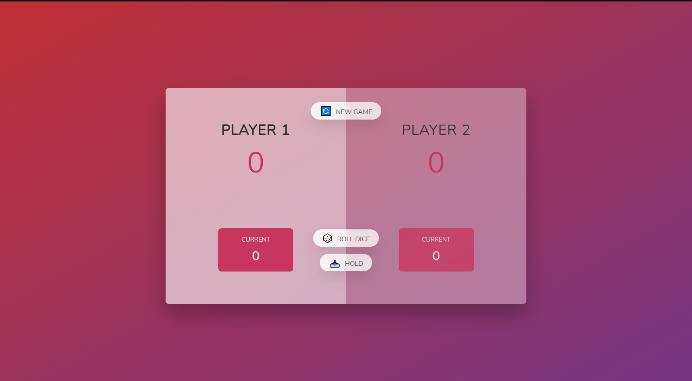

# Pig Game Overview

# Project Description 😪

---

This game is basically I build for my practice. I copied idea from jonas Schmedtmann. He is a instructor of Udemy. So This projects was included ( The Complete JavaScript Course 2021: From Zero to Expert! ) . Dom Based Project

# Game Description 🎲

---

This is a  Multiplayer game ( 2 players can play at a time ) , Player 1 & Player 2 . Player 1 will get first chance to play. So players will roll the dice and randomly they will get number of dice . If Roll dice get 1 then player current score will be 0 and dice will be switch over next player . If player hold their current score before dice get 1 then the currentScore will be add on Player main score. 

### Win Case

---

If any of player scored 100 then that player will win that match 

### Finish Game

---

After game over, if player want play another round then they have to click on new Game 

# Technology Used 🛠

---

- HTML
- CSS
- JAVASCRIPT
